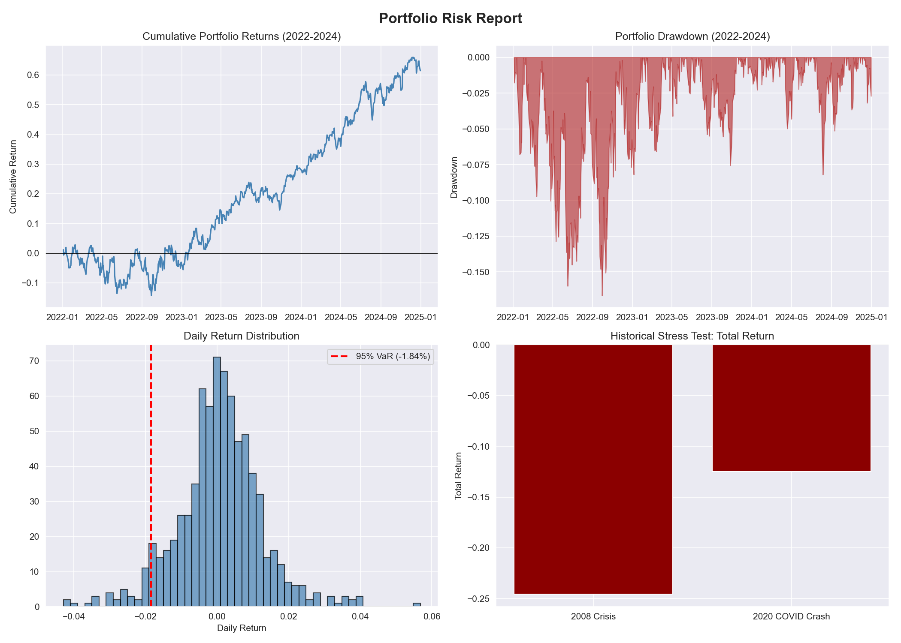

# Portfolio Risk Analysis

A staged, quant-style portfolio risk management system built in Python — covering return modeling, volatility, Value-at-Risk, CAPM beta estimation, and historical stress testing against real market data.

Built as a portfolio project demonstrating financial risk analysis fundamentals for data/finance roles.

## Portfolio

Equal-weighted (25% each): **AAPL, MSFT, JPM, XOM** — chosen to span tech and energy/financials for a real diversification story.

## Risk Report



## Key Results Summary

| Metric | Value | Interpretation |
|---|---|---|
| Annualized volatility (portfolio) | 18.69% | vs. 26.73% weighted-average — a 30.1% risk reduction from diversification |
| 1-Day 95% VaR | 1.84% ($1,840 on $100k) | Backtested at 5.06% breach rate — well-calibrated |
| 1-Day 99% VaR | 3.02% ($3,025 on $100k) | Tail risk nearly doubles vs. 95% VaR |
| Max drawdown (2022-2024) | -16.65% | Peak-to-trough, Sept 2022 |
| Beta vs. S&P 500 | 0.948 | Slightly less volatile than the market |
| R-squared | 0.788 | ~79% of portfolio movement explained by the market |
| CAPM expected annual return | 8.31% | vs. 8.52% market return, consistent with beta < 1 |
| 2008 Crisis stress test | -24.58% (-$24,577 on $100k) | Worst single day: -12.46% |
| 2020 COVID stress test | -12.48% (-$12,477 on $100k) | Worst single day: -13.02% (more violent than 2008, shorter window) |

## Staged Build

- **Stage 1:** Data ingestion + daily/cumulative returns (`src/stage1_returns.py`)
- **Stage 2:** Portfolio construction + volatility, with diversification benefit analysis (`src/stage2_volatility.py`)
- **Stage 3:** Historical VaR (95%/99%) with backtesting and drawdown (`src/stage3_var.py`)
- **Stage 4:** CAPM beta estimation vs. S&P 500 via linear regression (`src/stage4_beta.py`)
- **Stage 5:** Historical stress testing (2008, 2020) + 4-panel visual risk report (`src/stage5_stress_test.py`)

Each stage is a standalone, runnable script — building in complexity from raw data to a full risk report.

## Tech Stack

- **pandas / numpy** — data wrangling and numerical calculations
- **yfinance** — historical market data
- **scipy** — linear regression (CAPM beta), statistical functions
- **matplotlib / seaborn** — visualization and reporting

## Setup

```bash
python3 -m venv venv
source venv/bin/activate
pip install -r requirements.txt

python src/stage1_returns.py
python src/stage2_volatility.py
python src/stage3_var.py
python src/stage4_beta.py
python src/stage5_stress_test.py
```

## Status

✅ Complete — all 5 stages implemented and validated against historical data.
